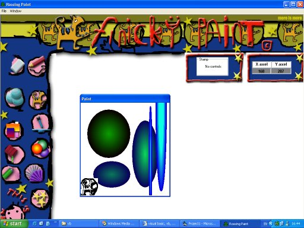



## Finicky Paint Final Version \*\*Updated\*\*

### Description

I have now fixed some bugs in it, you can now move the tool window's and the floodfill is fixed.

A useful paint program for kids in all ages with all the tools you want from a paint program. You must download this code. And it´s almost totally free from bugs. Plz vote and make a comment.
 
### More Info
 

             |
---                |---
**Submitted On**   |2002-03-19 17:12:54
**By**             |[Jonathan Rossing](https://github.com/Planet-Source-Code/PSCIndex/blob/master/ByAuthor/jonathan-rossing.md)
**Level**          |Intermediate
**User Rating**    |5.0 (30 globes from 6 users)
**Compatibility**  |VB 6\.0
**Category**       |[Graphics](https://github.com/Planet-Source-Code/PSCIndex/blob/master/ByCategory/graphics__1-46.md)
**World**          |[Visual Basic](https://github.com/Planet-Source-Code/PSCIndex/blob/master/ByWorld/visual-basic.md)
**Archive File**   |[Finicky\_Pa634153192002\.zip](https://github.com/Planet-Source-Code/jonathan-rossing-finicky-paint-final-version-updated__1-30854/archive/master.zip)

